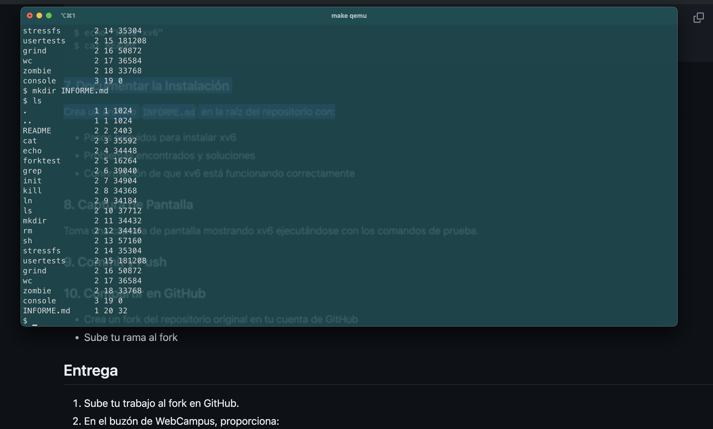

# PASOS PARA INSTALAR XV6:

1. Instalar homebrew y git, en mi caso, ya los tenia instalados previamente.
2. Instalar qemu con brew.
   1. brew install qemu
3. Hacer fork del repositorio presente en la ppt de la clase 2. (https://github.com/mit-pdos/xv6-riscv)
4. Instalar las dependencias y el toolchain necesario indicado en el directorio. (De ser necesario, realizar troubleshooting.)
   1. brew tap riscv/riscv
   2. brew install riscv-tools
5. Clonar el repositorio de manera local, al cual le hicimos fork en github en el paso 3.
   1. git clone `<repo_en_tu_cuenta_de_github>`
6. Hacer cd al directorio que nos interesa por consola.
7. Hacer [make qemu]() en el terminal para "construir" el proyecto.
8. Verificar instalación con los comandos indicados en el ppt para asegurarte de que todo esté funcionando.
   1. ls
   2. $echo "Hola mundo"
   3. cat README
9. Sacar pantallazo y incluirlo en el repositorio para Tarea 0.

# PROBLEMAS ENCONTRADOS:

- Estoy usando macOS, por lo que no tuve mayores problemas dado que la instalación es bastante directa en este sistema operativo. Sin embargo, para acceder a las librerias, tuve ciertos problemas de compatibilidad dado que tengo diversas versiones de librerias pasadas que tal vez estaban haciendo conflicto con las librerias usadas para este ramo y la utilizacion del XV6. Luego de unos cuantos intentos para instalarlos, usando diversos comandos con ayuda de ChatGPT para el troubleshooting, logre instalar las librerias sin problema al modificar los PATHs de instalación y modificando las versiones de librerias antiguas. Actualmente todo corre de manera indicada y sin problemas.

# CONFIRMACIÓN:

- La confirmacion del sistema funcionando esta en la captura de pantalla llamada "xv6-funcionando.png", la cual esta ubicada en este mismo directorio. Sin embargo, se adjunta el pantallazo en este markdown:

