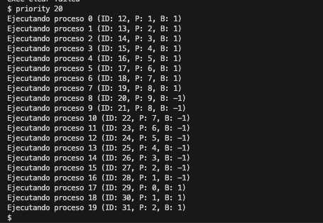

## README - Tarea 2

### Matías Heilenkötter M.

### Sistemas Operativos 2024/2


## Implementación

En primer lugar, se definen las variables `priority` y `boost` en la estructura del proceso dentro del archivo `proc.h`, para su posterior inicialización.

```
struct proc {
  struct spinlock lock;

  // p->lock must be held when using these:
  enum procstate state;        // Process state
  void *chan;                  // If non-zero, sleeping on chan
  int killed;                  // If non-zero, have been killed
  int xstate;                  // Exit status to be returned to parent's wait
  int pid;                     // Process ID
  
  // Tarea 2
  int priority;
  int boost;


};

```


En el archivo `proc.c`, inicializamos estas variables con los valores 0 y 1 respectivamente, en base a las indicaciones del documento de la tarea.


```
found:
  p->pid = allocpid();
  p->state = USED;

  // Inicializar prioridad y boost (0 y 1)
  p->priority = 0;
  p->boost = 1;
```


Posteriormente, modificamos la función `scheduler()` en el archivo `proc.c`. En esta función, implementamos la lógica para aumentar y disminuir la prioridad al recorrer la lista de procesos disponibles. 


```
int found = 0;
    for(p = proc; p < &proc[NPROC]; p++) {
      acquire(&p->lock);
      if(p->state == RUNNABLE) {

        // Lógica de la prioridad y boost
        p->priority += p->boost;
```


La ejecución de un proceso se prioriza según su valor de `priority`, con el objetivo que los procesos de mayor prioridad se ejecuten lo más pronto posible. Cada vez que se crea un nuevo proceso, se actualizan las prioridades de los procesos en ejecución (a excepcion de aquellos en estado zombie) de acuerdo con la lógica del `boost`.


```

        // Variar boost respecto al valor de la prioridad
        if (p->priority >= 9) {
          p->boost = -1;
        }
        if (p->priority <= 0) {
          p->boost = 1;
        }

        // Switch to chosen process.  It is the process's job
        // to release its lock and then reacquire it
        // before jumping back to us.
        p->state = RUNNING;
        c->proc = p;
        swtch(&c->context, &p->context);

        // Process is done running for now.
        // It should have changed its p->state before coming back.
        c->proc = 0;
        found = 1;
      }
      release(&p->lock);
    }
```


Finalmente, se creó el archivo `priority.c` en la carpeta `USER`, donde creamos un número específico de procesos hijos basado en la entrada del usuario, utilizando el comando: `$ priority (número de procesos)`. Al ejecutarse, el programa imprime la información de los procesos en ejecución, incluyendo su ID, valor de prioridad y boost. 

```
// Definir al usuario como utilizar la función priority.c
    if (argc != 2) {
        printf("Uso correcto: %s <cantidad_procesos>\n", argv[0]);
        exit(1);
    }
```


# Problemas encontrados

Los conflictos de mayor relevancia para realizar este trabajo fueron respecto a la función scheduler(), dado que se presentaron diversos errores como ***panic:acquire*** y ***panic:kerneltrap***, los cuales me tuvieron mucho rato haciendo troubleshooting. 

El primero de ellos, ocurría porque un proceso intentaba adquirir un lock que ya estaba siendo utilizado. Para solucionarlo,  a grandes rasgos, tuve que modificar el codigo para que los procesos sean liberados correctamente despues de ser usados.

El segundo ocurre cuando hay una excepción o interrupción que el kernel no es capaz de solucionar. Esto ocurre por un mal manejo de interrupciones, acceso a la memoria o a las excepciones. No estoy seguro como se soluciona este error, ya que mi forma de arreglarlo fue directamente cambiar el enfoque del codigo hasta que el error no aparecía más.

# Archivos

Es importante destacar que el proceso padre espera a que todos los procesos hijos finalicen antes de salir del bucle. Adicionalmente, cabe mencionar que a lo largo de la tarea, se modificaron en gran medida los archivos: proc.c y sysproc.c, mientras que se realizaron modificaciones en menor medida en los archivos: proc.h, user.h, Makefile, usys.pl, sysproc.c, syscall.c, syscall.h , mientras que se incorporo el nuevo archivo priority.c para probar la función $ ***priority***.


Se incorpora el "Screenshot procesos.png" para evidenciar el uso de la función "priority 20", indicada en el documento de la tarea.


# Prueba final


